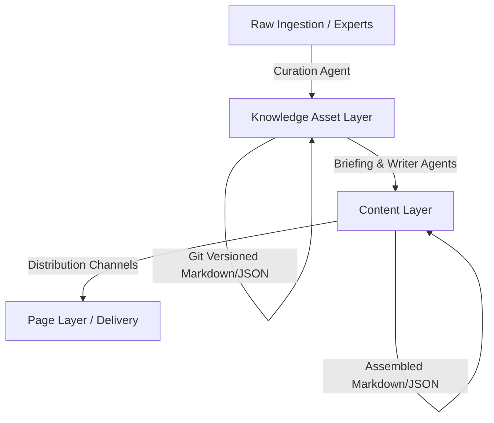

# System Architecture: Aether Knowledge Factory

The Aether Knowledge Factory is an AI-native knowledge operating system. It treats structured expert knowledge as a permanent, version-controlled asset, decoupling it from temporary content outputs and delivery pages.

## The Knowledge-Content-Page Hierarchy

We organize information into three layers:

1. **Knowledge Layer (Permanent Assets)**: Highly structured, verified facts, ideas, insights, and concepts. Represented as markdown files with explicit YAML metadata.
2. **Content Layer (Ephemeral Assemblies)**: Synthesized materials (blog posts, FAQs, service descriptions) targeted at specific audiences or use cases, compiled directly from the Knowledge Layer.
3. **Page Layer (Distribution/Delivery)**: Output formats mapped to delivery targets (e.g., Webflow API payload, HTML, raw PDFs).

---

## Agent Communication & Roles

Instead of single, large generalist agents, the Factory relies on specialized, single-responsibility agents:

* **Ingestion/Curation Agent**: Receives raw materials and extracts them into structured knowledge units matching the strict schema definitions.
* **Orchestrator**: Choreographs the pipeline, manages state transitions, and enforces output schema validation.
* **Writer Agent**: Reads validated content briefs and knowledge units to compose creative copy using Aether's brand tone guidelines.

---

## Human-in-the-Loop (HITL) Checkpoints

To preserve quality and authority, human reviews are injected at critical gates:
1. **Knowledge Curation Gate**: Verification of extracted facts/insights before committing to the `knowledge/` store.
2. **Briefing Gate**: Approval of the generated content brief before drafting begins.
3. **Publication Gate**: Approval of the final content piece before distributing to external pages.
